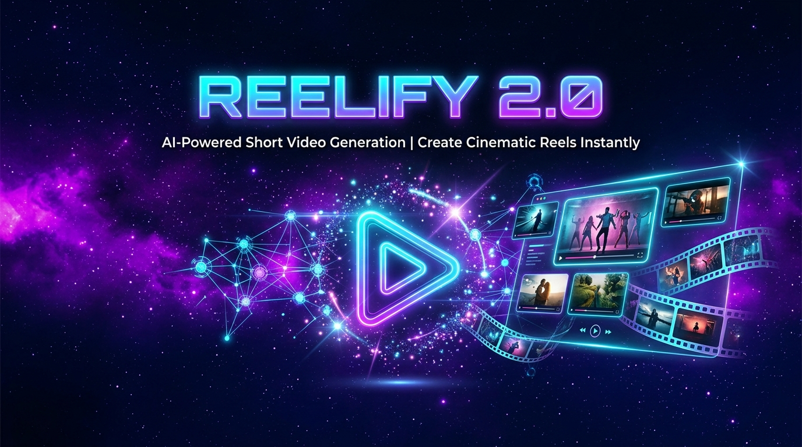
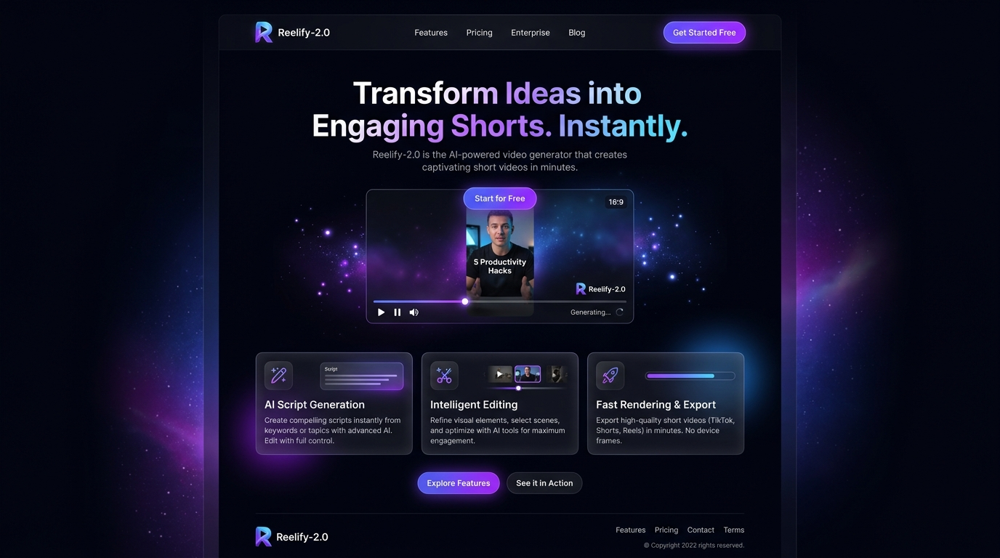
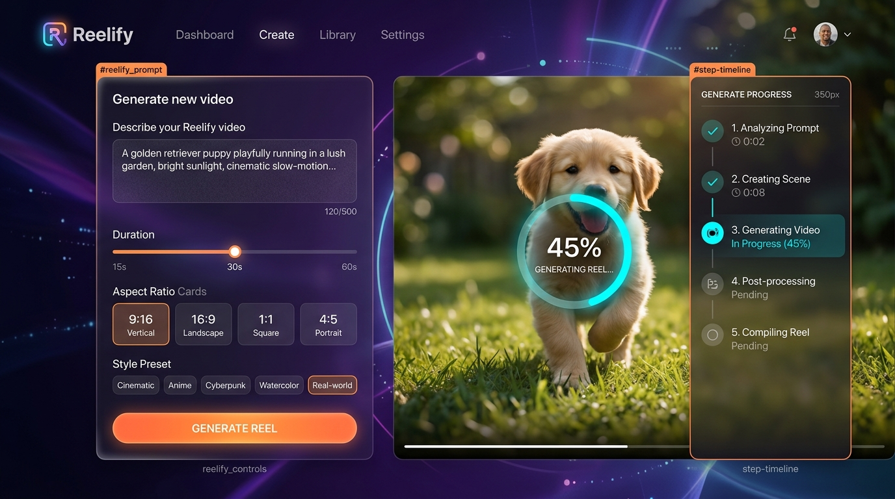
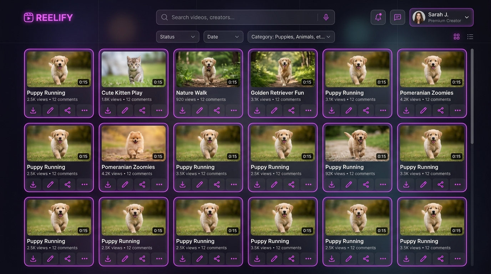
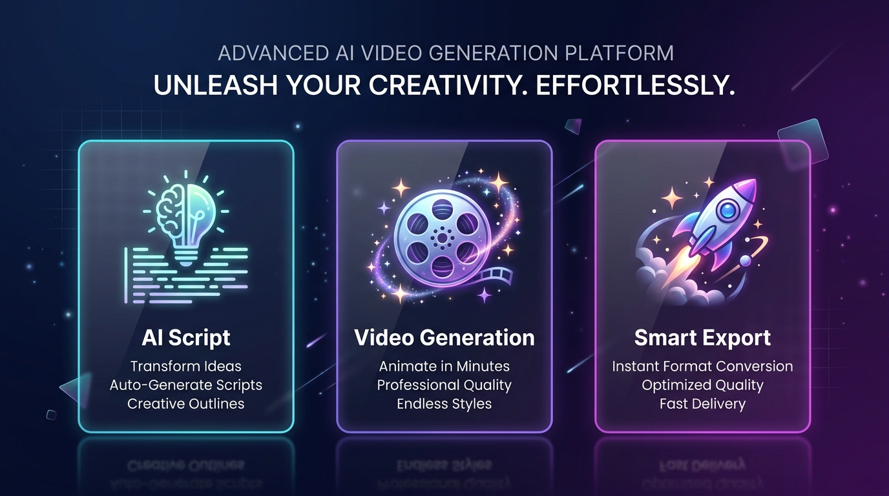
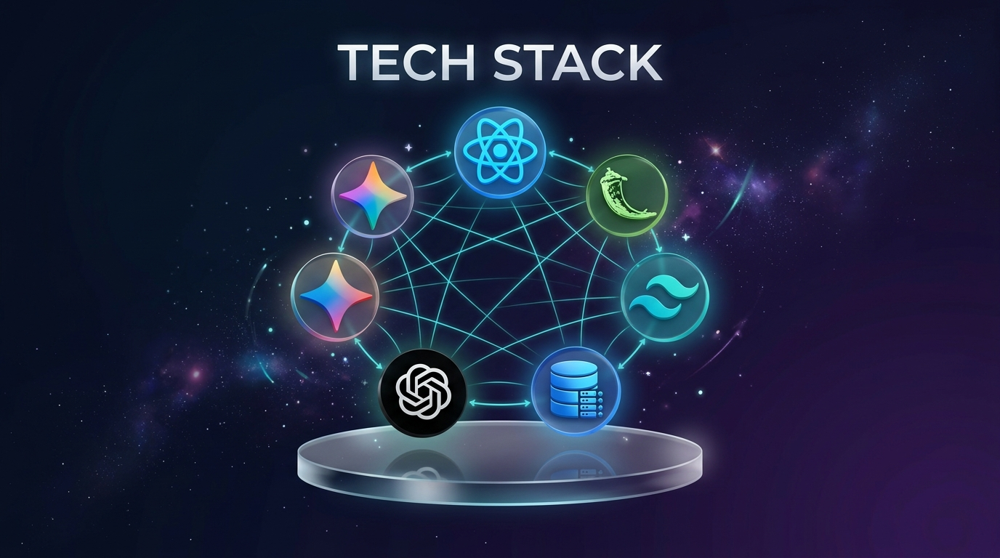
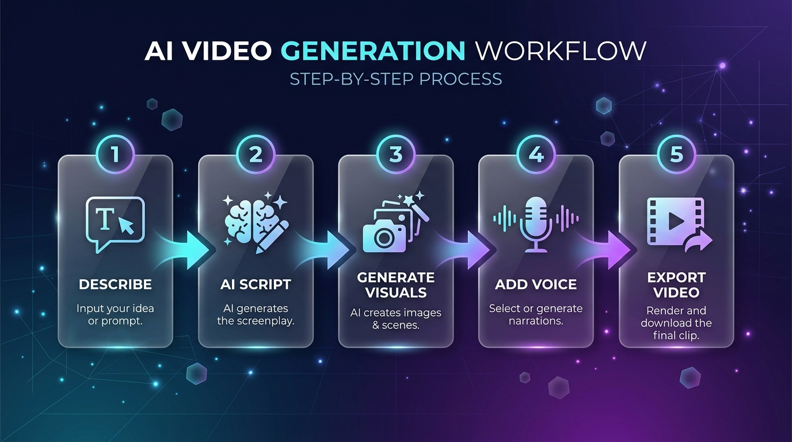
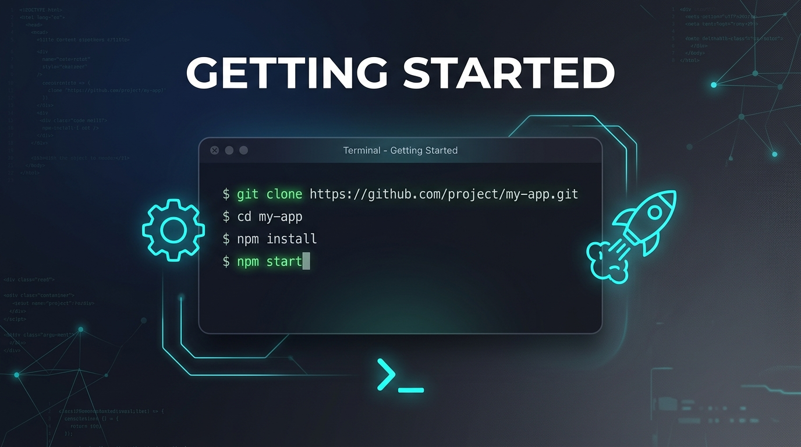
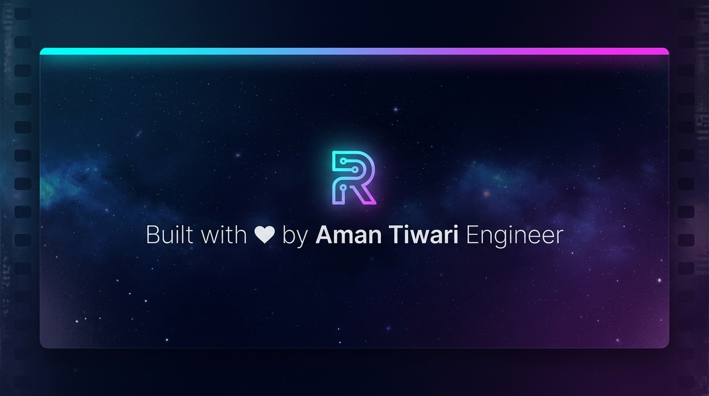

<p align="center">
  
</p>

<h1 align="center">🎬 Reelify 2.0</h1>

<p align="center">
  <strong>Transform your ideas into captivating short-form videos in seconds using Generative AI.</strong>
</p>

<p align="center">
  <a href="#-features"></a>
  <a href="#-tech-stack"></a>
  <a href="#-getting-started"></a>
  <a href="#-api-endpoints"></a>
  <a href="#-deployment"></a>
</p>

<p align="center">
  
  
  
  
  
  
  
  
</p>

<br/>

---

<br/>

## 📸 Preview

<p align="center">
  
  <br/><br/>
  <em>🏠 Landing Page — A stunning hero section with cosmic design and feature highlights</em>
</p>

<br/>

<p align="center">
  
  <br/><br/>
  <em>🎥 Generator Page — Describe your video, customize settings, and watch AI create it step-by-step</em>
</p>

<br/>

<p align="center">
  
  <br/><br/>
  <em>📊 Dashboard — Browse, manage, and filter all your generated videos in one place</em>
</p>

<br/>

---

<br/>

## ✨ Features

<p align="center">
  
</p>

<br/>

<table>
  <tr>
    <td align="center" width="33%">
      <h3>🧠 AI Script Generation</h3>
      <p>Gemini 1.5 Flash & GPT-4o-mini write optimised short-form scripts from just a text prompt</p>
    </td>
    <td align="center" width="33%">
      <h3>🎬 Video Generation Flow</h3>
      <p>Step-by-step progress UI: Script → Visuals → Voice → Render with real-time status</p>
    </td>
    <td align="center" width="33%">
      <h3>🔐 JWT Authentication</h3>
      <p>Secure login & registration with JSON Web Tokens protecting private routes</p>
    </td>
  </tr>
  <tr>
    <td align="center" width="33%">
      <h3>🗄️ Persistent Storage</h3>
      <p>SQLite database — all users and generated videos survive server restarts</p>
    </td>
    <td align="center" width="33%">
      <h3>📱 Responsive Design</h3>
      <p>Mobile-first layout that works beautifully on all screen sizes</p>
    </td>
    <td align="center" width="33%">
      <h3>🎛️ Multiple Options</h3>
      <p>Duration, format (9:16 / 16:9 / 1:1), style presets, voice, music & captions</p>
    </td>
  </tr>
  <tr>
    <td align="center" width="33%">
      <h3>⚡ Unified Server</h3>
      <p>Frontend & Backend served from a single Flask server on port 5000</p>
    </td>
    <td align="center" width="33%">
      <h3>🛡️ Rate Limiting</h3>
      <p>10 requests/min per IP to protect API quotas and prevent abuse</p>
    </td>
    <td align="center" width="33%">
      <h3>📤 Secure Uploads</h3>
      <p>JWT-protected, extension-checked, 16 MB cap for custom assets</p>
    </td>
  </tr>
</table>

<br/>

---

<br/>

## 🛠 Tech Stack

<p align="center">
  
</p>

<br/>

| Layer | Technology | Purpose |
|:---:|:---|:---|
| 🎨 **Frontend** | React.js 18 · Vite · Tailwind CSS | Fast, responsive UI with utility-first styling |
| ⚙️ **Backend** | Python · Flask · Flask-JWT-Extended | RESTful API server with auth middleware |
| 🗃️ **Database** | SQLite (via stdlib `sqlite3`) | Lightweight, zero-config persistent storage |
| 🤖 **AI Engine** | Gemini 1.5 Flash (primary) · GPT-4o-mini (fallback) | AI script generation & content intelligence |
| 🔄 **State** | React Context API | Global auth and app state management |
| 🌐 **HTTP** | Axios · REST APIs | Client-server communication |
| 🔑 **Auth** | JWT (JSON Web Tokens) | Stateless, secure authentication |

<br/>

---

<br/>

## 🔄 How It Works

<p align="center">
  
</p>

<br/>

```
 ╔══════════════╗     ╔══════════════╗     ╔══════════════╗     ╔══════════════╗     ╔══════════════╗
 ║  📝 DESCRIBE ║ ──▶ ║  🧠 AI SCRIPT║ ──▶ ║ 🎨 VISUALS   ║ ──▶ ║ 🎤 VOICE     ║ ──▶ ║ 🎬 EXPORT    ║
 ║  Your idea   ║     ║  Generation  ║     ║  Generation  ║     ║  Synthesis   ║     ║  Final Video ║
 ╚══════════════╝     ╚══════════════╝     ╚══════════════╝     ╚══════════════╝     ╚══════════════╝
```

<br/>

<p align="center">
  
  <br/><br/>
  <em>🏗️ Complete Architecture — From idea to AI-generated short video, end-to-end</em>
</p>

<br/>

---

<br/>

## 🚀 Getting Started

<p align="center">
  
</p>

<br/>

### Prerequisites

> **You'll need these installed on your machine:**

| Tool | Version | Required |
|:---|:---|:---:|
| Node.js | 18+ | ✅ |
| Python | 3.9+ | ✅ |
| API Keys | Gemini / OpenAI / Pexels | ⚡ Optional — app works in demo mode |

<br/>

### 1️⃣ Clone the Repository

```bash
git clone https://github.com/Aman-Farmer19/Reelify-2.0.git
cd Reelify-2.0/reelify
```

### 2️⃣ Configure Environment

```bash
cd backend
cp .env.example .env
```

Generate a secure JWT secret:
```bash
python -c "import secrets; print(secrets.token_hex(32))"
```

Edit `.env` and paste your secret + any API keys.

### 3️⃣ Run the App

<details>
<summary><b>⚡ Option A: One-Click Launcher (Windows)</b></summary>

```powershell
.\start.bat
```

This builds the frontend and starts the Flask server automatically.

</details>

<details>
<summary><b>🔧 Option B: Manual Setup</b></summary>

**Step 1 — Build the Frontend**
```bash
cd frontend
npm install
npm run build
cd ..
```

**Step 2 — Start the Backend**
```bash
cd backend
python -m venv venv
venv\Scripts\activate          # Windows
# source venv/bin/activate     # macOS/Linux
pip install -r requirements.txt
python app.py
```

</details>

### 4️⃣ Open in Browser

```
🌐  http://localhost:5000
```

<br/>

---

<br/>

## 📡 API Endpoints

| Method | Endpoint | Description | Auth |
|:---:|:---|:---|:---:|
| `POST` | `/api/auth/register` | Create a new account | 🔓 No |
| `POST` | `/api/auth/login` | Log in & get JWT token | 🔓 No |
| `POST` | `/api/generate` | Generate AI video *(rate limited: 10/min)* | ⚡ Optional |
| `GET` | `/api/videos` | Fetch user's generated videos | 🔒 Required |
| `POST` | `/api/upload` | Upload custom asset *(16 MB max)* | 🔒 Required |
| `GET` | `/api/health` | Server health check | 🔓 No |

<br/>

---

<br/>

## 🔐 Environment Variables

| Variable | Required | Description |
|:---|:---:|:---|
| `JWT_SECRET` | ✅ Production | Long random string for JWT signing |
| `FLASK_DEBUG` | ❌ | Set `true` for local dev only |
| `GEMINI_API_KEY` | ⚡ | Gemini 1.5 Flash (primary AI engine) |
| `OPENAI_API_KEY` | ⚡ | GPT-4o-mini script generation (fallback) |
| `PEXELS_API_KEY` | ⚡ | Stock video search |
| `PIXABAY_API_KEY` | ⚡ | Stock video fallback |

<br/>

---

<br/>

## 📁 Project Structure

```
reelify/
├── start.bat                 # 🚀 One-click launcher (builds UI + runs Flask)
├── server.js                 # Dev runner utility
│
├── frontend/
│   ├── dist/                 # Built production files (served by Flask)
│   ├── src/
│   │   ├── components/
│   │   │   ├── Navbar.jsx    # Top navigation bar
│   │   │   ├── Sidebar.jsx   # Dashboard sidebar
│   │   │   ├── AuthModal.jsx # Login / Signup modal
│   │   │   └── VideoCard.jsx # Video card component
│   │   ├── pages/
│   │   │   ├── LandingPage.jsx   # Home / Hero page
│   │   │   ├── Dashboard.jsx     # User video dashboard
│   │   │   └── Generator.jsx     # AI video generation page
│   │   ├── context/
│   │   │   └── AuthContext.jsx   # Auth state management
│   │   ├── App.jsx           # Routes and layout
│   │   ├── main.jsx          # React entry point
│   │   └── index.css         # Global Tailwind styles
│   ├── index.html
│   ├── package.json
│   ├── vite.config.js
│   └── tailwind.config.js
│
├── backend/
│   ├── app.py                # Flask Server (serves React + API routes)
│   ├── reelify.db            # SQLite database (auto-created)
│   ├── requirements.txt
│   ├── .env.example          # Template — copy to .env and fill in keys
│   └── .env                  # 🚫 Never commit this file
│
├── .gitignore
└── README.md
```

<br/>

---

<br/>

## ☁️ Deployment

> **Since the frontend is served statically by Flask, the entire app deploys as a single service.**

### Deploy on [Render](https://render.com) or [Railway](https://railway.app)

**1.** Push your repo to GitHub *(ensure `.env` is in `.gitignore`* ✅*)*

**2.** Create a new **Web Service** on your platform

**3.** Set environment variables:

| Key | Value |
|:---|:---|
| `JWT_SECRET` | A 32+ char random string |
| `FLASK_DEBUG` | `false` |
| `GEMINI_API_KEY` | Your key *(optional)* |
| `OPENAI_API_KEY` | Your key *(optional)* |
| `PEXELS_API_KEY` | Your key *(optional)* |

**4.** Build Command:
```bash
cd frontend && npm install && npm run build && cd ../backend && pip install -r requirements.txt
```

**5.** Start Command:
```bash
cd backend && gunicorn app:app
```

> [!NOTE]
> SQLite `reelify.db` is stored on the server's local disk. On Render's free tier, the disk resets on deploy. For persistent storage, upgrade to Render's **Persistent Disk** add-on or migrate to PostgreSQL.

<br/>

---

<br/>

## 🤝 Contributing

Contributions, issues, and feature requests are welcome!

1. **Fork** the repository
2. **Create** your feature branch (`git checkout -b feature/amazing-feature`)
3. **Commit** your changes (`git commit -m 'Add amazing feature'`)
4. **Push** to the branch (`git push origin feature/amazing-feature`)
5. **Open** a Pull Request

<br/>

---

<br/>

## 📄 License

This project is open source and available under the [MIT License](LICENSE).

<br/>

---

<br/>

<p align="center">
  
</p>

<h3 align="center">Built with ❤️ by Aman Tiwari Software Engineer</h3>

<p align="center">
  <strong>Son Of Farmer</strong>
</p>

<p align="center">
  <a href="https://github.com/Aman-Farmer19">
    
  </a>
  &nbsp;&nbsp;
  <a href="https://linkedin.com">
    
  </a>
</p>

<br/>

<p align="center">
  <em>Built with React.js · Flask · SQLite · Tailwind CSS · Generative AI</em>
</p>

<p align="center">
  
  
</p>
